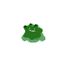
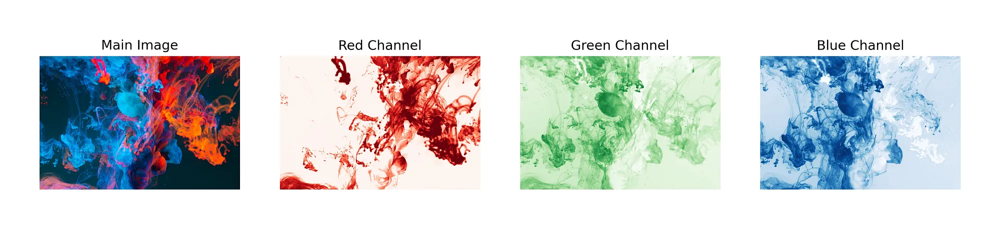
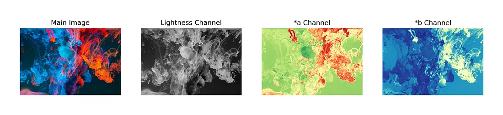

<div style="text-align: center;">

</div>

<h1 class="t">Aprendizagem Profunda – 2023.1</h1>

**Prof. Dr. Saulo Oliveira**

**Data de Entrega:** 26 de junho de 2023.

**Meio de Entrega:** Seminário.


## Dataset: Sprites da pokeapi.co

Pokémon moldou toda a minha infância e foi a primeira coisa que me veio à mente quando procurava um conjunto de dados interessante de pequenas imagens. Eu mesmo faço o uso da [PokeAPI](pokeapi.co) nas disciplinas de Desenvolvimento WEB e Programação para Dispositivos móveis. Eu descobri e explorei este mundo principalmente jogando uma variedade de diferentes videogames tradicionais de Pokémon, começando inicialmente no ```Pokémon Red``` (Geração 1) e terminando no ```Pokémon Emerald``` (Geração 3), tudo via emuladores -- infância reduzida em termos de recursos financeiros e telemáticos. 


O primeiro filme do Pokémon também foi a primeira ida ao cinema, nos anos 2000, lá no **Cinema São Luiz**, hoje, **Cineteatro São Luíz**. Uma tia minha, levou uma comitiva de 05 sobrinhos para assistir ao longa-metragem e depois lanchar no McDonalds da Rua Barão do Rio Branco. Nostalgia!

 


Confesso que nem entendia direito o que o Mewtwo falava enquanto filosofava sobre a sua existência. Para quem não lembra, o Mewtwo era um Pokémon clonado a partir do DNA do Mew. Deixo aqui algumas de suas mais célebres falas:

> As circunstâncias do nascimento de alguém são irrelevantes. É o que você faz com o dom da vida que determina quem você é. 

>Aqueles que me criaram nunca perguntaram se eu queria existir. Por isso, eu não posso perdoá-los.

> Nós temos muita coisa em comum, a mesma terra, o mesmo ar, o mesmo céu. Talvez se começássemos a olhar para as coisas que temos em comum ao invés de diferente… Bom, quem sabe?


*Voltando ao trabalho...*

Enquanto na **primeira geração existiam 151** Pokémons diferentes, esse número cresceu **rapidamente para 1015** na nona geração, a mais recente. Uma dos elementos de maior cobiça durante qualquer um dos jogos era o de se capturar um Pokémon Brilhante, do inglês *Pokémon Shiny*. 

Os Pokémons Shinies surgiram em 21 de novembro de 1999 com o lançamento de Pokémon Gold & Silver para o Game Boy, no Japão, que chegou em 15 de outubro de 2000 no ocidente. Nos jogos, existia um Gyarados vermelho, e também era possível encontrar outras criaturas selvagens com colorações diferentes. Na época, a chance de encontrar um Pokémon Shiny era de 1 em 8192, ou seja, $ \approx 0,0001\%$, número que foi reduzido nos títulos seguintes 😢. 


Para este projeto, compilei um conjunto de dados personalizado das imagens de sprites Pokémon das primeiras cinco gerações.

## PokeAPI

É uma interface de API RESTful para objetos altamente detalhados construídos a partir de milhares de linhas de dados relacionados ao mundo Pokémon, mais especificamente à franquia de videogames. Usando este site, você pode consumir informações sobre Pokémons, seus movimentos, habilidades, tipos, grupos de ovos e muito, muito mais. 

No nosso caso, a entrada de cada Pokémon há um campo chamado ```sprites```. Ao passo que ao se fazer um ```clone``` do repositório ```https://github.com/PokeAPI/sprites.git```, as imagens em <kbd>png</kbd> possuem uma nomeação com base na numeração de cada Pokémon. Por exemplo, o Pokémon <kbd>Bulbasauro</kbd> que é o primeiro da lista pode ser acessado através do seguinte caminho ```sprites/pokemon/1.png```, ao passo que o <kbd>Mewtwo</kbd>, o 150º, é acessado através do  caminho ```sprites/pokemon/150.png```. 

**Todos os arquivos são imagens coloridas, com fundo transparente, quadradas, com dimensões  $96 \times 96$**.

```python
# https://pokeapi.co/api/v2/pokemon/ditto
{
  [...] # outros atributos
  "sprites": {
    "back_default": "https://raw.githubusercontent.com/PokeAPI/sprites/master/sprites/pokemon/back/132.png",
    "back_female": null,
    "back_shiny": "https://raw.githubusercontent.com/PokeAPI/sprites/master/sprites/pokemon/back/shiny/132.png",
    "back_shiny_female": null,
    "front_default": "https://raw.githubusercontent.com/PokeAPI/sprites/master/sprites/pokemon/132.png",
    "front_female": null,
    "front_shiny": "https://raw.githubusercontent.com/PokeAPI/sprites/master/sprites/pokemon/shiny/132.png",
    "front_shiny_female": null,
	}
  [...] # outros atributos
}
```

## O que é o trabalho?

A equipe precisará propor uma **rede neural** com uma das arquiteturas anteriormente descritas e gerar **novos Pokémons Brilhantes** (as cores modificadas) com base na sua imagem original, isto é, a rede deverá se comportar como um colorizador. **As cores não precisam ser as oficiais**. 

Basta que as imagens geradas possua coloração diferente, como no exemplo abaixo em que temos o Pokémon Ditto na sua cor original, em rosa, a versão brilhante, em azul, e, por fim, em verde, a saída da ```SauloShinyPokémonNet```:




## RGB vs L\*a\*b

Ao carregar uma imagem, obtemos um Tensor de rank-3 (altura, largura, canal) com o último  contendo os dados de cor da nossa imagem. Esses dados representam a cor no espaço de cores RGB e há 3 números para cada pixel indicando quanto vermelho, verde e azul o pixel tem. Na imagem a seguir, você pode ver que na parte esquerda da *imagem principal*  (a imagem mais à esquerda) temos a cor azul, portanto, no canal azul da imagem, essa parte tem valores mais altos e ficou escura.



No espaço de cores L\*a\*b, temos novamente três canais para cada pixel, mas esses canais têm significados diferentes. O primeiro número (canal), L, codifica a **luminosidade** de cada pixel e quando visualizamos este canal (a segunda imagem da linha abaixo) ele aparece como uma imagem em tons de cinza. Os canais \*a  e \*b codificam a quantidade de verde-vermelho e amarelo-azul de cada pixel, respectivamente. Na imagem a seguir, você pode ver cada canal do espaço de cores L\*a\*b separadamente.



Em estudos sobre colorização, os autores usam o espaço de cores  L\*a\*b em vez de RGB para treinar os modelos. Existem algumas razões para essa escolha, e uma gritante é o quão o modelo terá uma tarefa mais fácil de executar.

Para treinar um modelo para colorização, devemos dar a ele uma imagem em tons de cinza e esperar que o modelo a torne colorida. Ao usar  L\*a\*b, podemos dar o canal L ao modelo (que é a imagem em tons de cinza) e querer que ele preveja os outros dois canais (*a, *b) e após sua estimação, concatenamos todos os canais e obtemos nossa imagem colorida. Mas se você usar RGB, você deve primeiro converter sua imagem em tons de cinza, alimentar a imagem em tons de cinza para o modelo e esperar que ele preveja 3 canais para você, o que é uma tarefa muito mais difícil e instável devido às muitas combinações possíveis de 3 números em comparação com dois números. Se assumirmos que temos 256 opções (em uma imagem inteira sem sinal de 8 bits, esse é o número real de opções) para cada número, prever os três canais para cada um dos pixels é escolher entre 256³ combinações, o que representa mais de **16 milhões de possibilidades**, <mark>mas ao prever dois números, temos cerca de <strong>65K possibilidades</strong></mark>.


## Regras gerais

A seguir, as regras que delimitam os aspectos desse projeto:

- Utilizem os dados da segunda geração em diante,  do 152º ao 1015º, para treino e os da primeira geração, do 1º ao 151º, para teste;
- **Não pode usar rede treinada, ou seja, o treinamento tem que partir de vocês;**
- **Não pode fazer aprendizagem por transferência;**
- Não pode pré-processar a imagem, com exceção de transformações de escala dos pixels e espaço de cor;
- O treinamento tem de ser via Google Colab.

## Comparação

Em construção...


# Referências

- Moein Shariatnia. **Colorizing black & white images with U-Net and conditional GAN — A Tutorial.** https://towardsdatascience.com/colorizing-black-white-images-with-u-net-and-conditional-gan-a-tutorial-81b2df111cd8, 2020. Acessado em 21 de maio de 2023.

